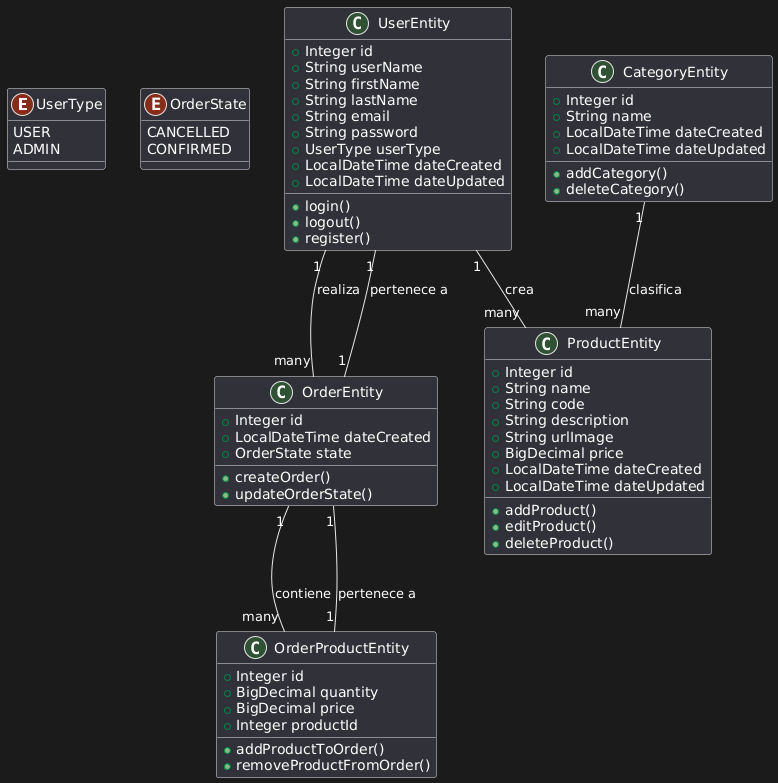
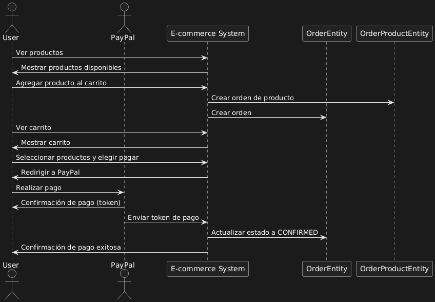
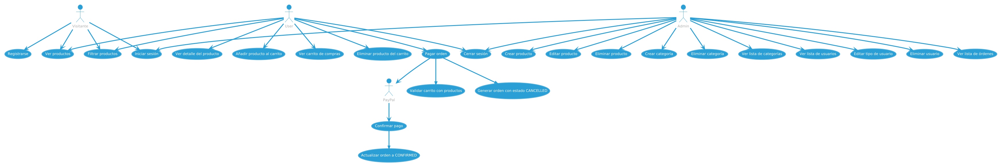
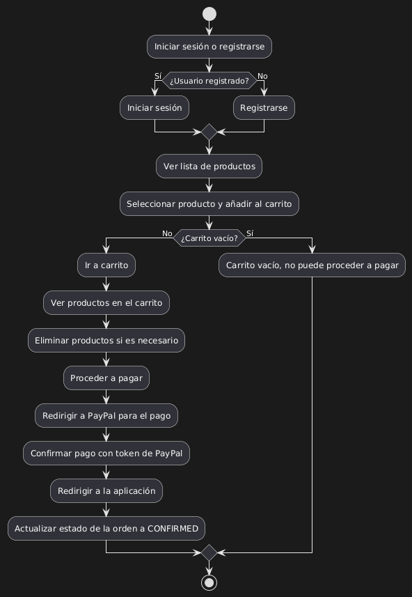

# 🛒 Saiyajin Store - Full Stack E-commerce App

Saiyajin Store is a full stack e-commerce web application built with **Angular** on the frontend and **Spring Boot** on the backend. Users can register, log in, browse products, make purchases via **PayPal**, while administrators can manage products, categories, users, and view orders.

---

## 🧰 Technologies Used

- **Backend:** Java, Spring Boot
- **Frontend:** Angular
- **Database:** PostgreSQL
- **Deployment:** Docker

### Backend (Java / Spring Boot)

- Spring Boot (with **Hexagonal Architecture**)
- Maven
- Spring Web
- Spring Data JPA
- Spring Security + JWT
- PostgreSQL
- Swagger
- Cloudinary (image management)
- PayPal SDK
- Lombok
- MapStruct

### Frontend (Angular)

- Angular 18+
- Bootstrap
- REST API consumption

### Infrastructure

- Docker + Docker Compose
- PostgreSQL as database
- Configurable environment variables
- UML diagrams generated with [PlantUML](https://www.plantuml.com/plantuml/)

---

---

## 🧭 UML Diagrams

The following diagrams illustrate the structure and behavior of the application:

### 📦 Class Diagram

Provides an overview of the main classes and their relationships.



### 🔁 Sequence Diagram

Illustrates the interaction between the user and the system when making a purchase.



### 🧩 Use Case Diagram

Displays the system's functionalities and actors involved.



### 🔄 Flowchart

Shows the general application flow, from login to checkout.



---

## 📦 Project Structure

├── docker-compose.yml
├── .env.example
├── README.md
├── backend/
│ ├── Dockerfile
│ └── README.md
└── frontend/
└── saijainstore/
├── Dockerfile
└── README.md

---

## 🚀 Running the Project (Production Mode)

1. Clone the repository:

```bash
git clone https://github.com/dulphyj/saiyajinstore

cd saiyajinstore
```

2. Copy the environment file:

```bash
cp .env.example .env
```

3. Update .env with your own environment variables.

---

## ⚙️ Environment Configuration

Before running the project, you need to create a `.env` file in the root directory.

Example: `.env.example`

```env
# Backend port
PORT=8080

# Database
DB_URL=jdbc:postgresql://saiyajin-db:5432/saiyajin
DB_USER=user
DB_PASSWORD=password

# Cloudinary
CLOUDINARY_CLOUD_NAME=your-cloud-name
CLOUDINARY_API_KEY=your-api-key
CLOUDINARY_API_SECRET=your-api-secret

# PayPal
PAYPAL_CLIENT_ID=your-paypal-id
PAYPAL_CLIENT_SECRET=your-paypal-secret

# JWT
JWT_SECRET=your-jwt-secret
JWT_EXPIRATION=600000
```

4. Build and start the containers:

```bash
docker-compose up --build
```

The frontend will be available at: http://localhost

The backend will be available at: http://localhost:8080

## 📦 Deployment Notes

- The application runs in production mode using Docker.

- The Angular frontend is built using:

```bash
ng build --configuration=production
```

- Spring Boot builds the backend JAR using:

```bash
mvn clean package -DskipTests
```

---

## 👥 Roles & Features

### 👤 Users

- Register & login

- Browse product catalog

- Add products to cart

- Checkout via PayPal

### 🛠️ Admins

**Perform full CRUD on:**

- Products

- Categories

- Users

- View and manage orders

---

## 💡 Notes

- Backend and frontend each have their own README.md files with further setup and development instructions.

- Make sure Docker and Docker Compose are installed before running the project.

---

👤 **Author:** [dulphyj](https://github.com/dulphyj)

---

## 📄 License

This project is licensed under the MIT License.
